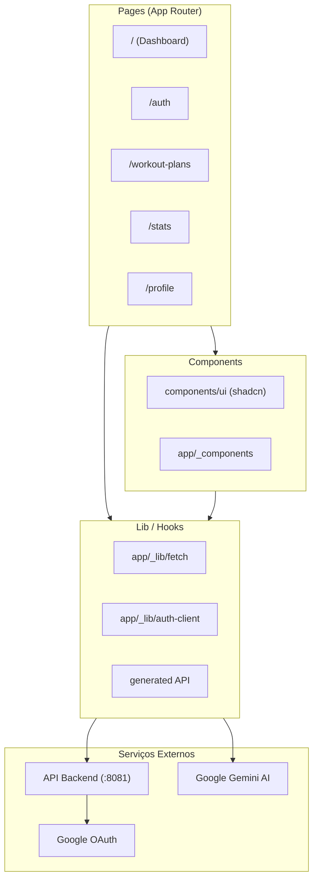
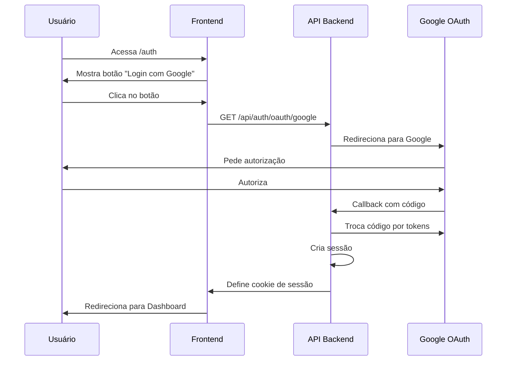

# Treinos Frontend

Aplicação web completa para gestão de planos de treino personalizados com assistente de IA. Desenvolvida para o projeto Bootcamp Treinos do FSC.

[](https://nextjs.org/)
[](https://react.dev/)
[](https://www.typescriptlang.org/)
[](https://tailwindcss.com/)

---

## Sumário

1. [Sobre o Projeto](#sobre-o-projeto)
2. [Stack Tecnológico](#stack-tecnológico)
3. [Arquitetura](#arquitetura)
4. [Estrutura do Projeto](#estrutura-do-projeto)
5. [Primeiros Passos](#primeiros-passos)
6. [Variáveis de Ambiente](#variáveis-de-ambiente)
7. [Rotas e Páginas](#rotas-e-páginas)
8. [Autenticação](#autenticação)
9. [Integração com API](#integração-com-api)
10. [Componentes UI](#componentes-ui)
11. [Build e Deploy](#build-e-deploy)

---

## Sobre o Projeto

### O que é esta aplicação?

O **Treinos Frontend** é a interface web completa para o sistema de gestão de treinos. Permite que usuários criem planos de treino personalizados com ajuda de um assistente de IA, acompanhem seu progresso e visualizem estatísticas de evolução.

### Funcionalidades Principais

- **Dashboard Personalizado**: Visualização do plano de treino ativo, dia atual e progresso
- **Criação de Planos via IA**: Chat com assistente virtual (Google Gemini) para gerar planos personalizados
- **Gerenciamento de Treinos**: Visualização de dias de treino, exercícios, séries e repetições
- **Tracking de Sessões**: Iniciar e finalizar sessões de treino com controle de tempo
- **Estatísticas**: Visualização de streak, consistência e evolução
- **Perfil do Usuário**: Dados antropométricos (peso, altura, idade, % gordura)
- **Autenticação Social**: Login via Google OAuth
- **Design Responsivo**: Layout adaptável para mobile, tablet e desktop

### Fluxo do Usuário

```
1. Usuário acessa a aplicação
2. Faz login via Google (ou é redirecionado para login)
3. No dashboard, visualiza seu plano de treino ativo
4. Pode iniciar uma sessão de treino ou conversar com a IA
5. A IA ajuda a criar/ajustar planos personalizados
6. Usuário acompanha estatísticas de consistência
```

---

## Stack Tecnológico

| Camada           | Tecnologia                              | Versão     |
| ---------------- | -------------------------------------- | ---------- |
| Framework        | Next.js (App Router)                   | 16.1.6     |
| Linguagem        | TypeScript                             | 5.x        |
| Runtime          | React                                   | 19.2.3     |
| Estado           | React Hooks + Context                  | -          |
| Server State     | TanStack Query (via AI SDK)            | 3.x / 6.x  |
| UI Components    | shadcn/ui (Radix UI)                  | 4.x / 1.4  |
| Estilização      | Tailwind CSS                           | 4.x        |
| Formulários      | React Hook Form + Zod                  | 7.x / 4.x  |
| AI Chat          | AI SDK + Google Gemini                 | 6.x / 3.x  |
| Autenticação     | Better-Auth                             | 1.4.18     |
| ícones           | Lucide React                           | 0.577.0    |
| Datas            | Day.js                                  | 1.11.19    |
| Linting          | ESLint                                  | 9.x        |
| Formatting       | Prettier                                | 3.8.1      |
| Integração de API| Orval                                | 8.1.0    |

---

## Arquitetura

### Padrão Arquitetural

Este projeto segue o padrão de **App Router com Composição de Componentes** do Next.js 16.

**Por que este padrão?**

- Server Components reduzem bundle size e melhoram performance
- Client Components para interatividade (chat, formulários, estados)
- Separação clara entre UI (components) e lógica (app/_lib)
- File-based routing intuitivo

### Visão Geral da Arquitetura



### Fluxo de Dados

```
┌─────────────────────────────────────────────────────────────┐
│                        USUÁRIO                               │
│  (interage com a interface)                                │
└─────────────────────┬───────────────────────────────────────┘
                      │
                      ▼
┌─────────────────────────────────────────────────────────────┐
│                   PAGES (Next.js)                           │
│  (Server/Client Components)                                │
│  - app/page.tsx (Dashboard)                                 │
│  - app/workout-plans/[id]/page.tsx                         │
│  - app/stats/page.tsx                                       │
└─────────────────────┬───────────────────────────────────────┘
                      │
                      ▼
┌─────────────────────────────────────────────────────────────┐
│                    COMPONENTS                               │
│  - app/_components/* (componentes específicos)             │
│  - components/ui/* (shadcn/ui atoms)                       │
└─────────────────────┬───────────────────────────────────────┘
                      │
                      ▼
┌─────────────────────────────────────────────────────────────┐
│                      LIB / HOOKS                            │
│  - app/_lib/fetch.ts (cliente HTTP)                        │
│  - app/_lib/auth-client.ts (Better-Auth)                  │
│  - app/_lib/api/generated/* (tipos da API via Orval)      │
└─────────────────────┬───────────────────────────────────────┘
                      │
                      ▼
┌─────────────────────────────────────────────────────────────┐
│                    BACKEND API                              │
│  (Fastify :8081)                                           │
└─────────────────────────────────────────────────────────────┘
```

---

## Estrutura do Projeto

```
treinos-frontend/
├── public/                          # Arquivos estáticos
│   ├── fit-ai-logo.svg            # Logo do app
│   ├── google-icon.svg            # Ícone Google
│   ├── login-bg.png               # Background login
│   ├── home-banner.jpg            # Banner home
│   ├── workout-plan-banner.png    # Banner planos
│   └── stats-banner.png           # Banner estatísticas
│
├── app/                             # App Router (Next.js 16)
│   ├── layout.tsx                  # Root layout
│   ├── page.tsx                    # Home (Dashboard)
│   ├── globals.css                 # Estilos globais
│   │
│   ├── auth/                       # Página de autenticação
│   │   ├── page.tsx
│   │   └── _components/
│   │       └── sign-in-with-google.tsx
│   │
│   ├── workout-plans/              # Páginas de planos
│   │   └── [id]/
│   │       ├── page.tsx           # Detalhes do plano
│   │       └── days/
│   │           └── [dayid]/
│   │               └── page.tsx   # Detalhes do dia
│   │
│   ├── stats/                      # Página de estatísticas
│   │   └── page.tsx
│   │
│   ├── profile/                     # Página de perfil
│   │   └── page.tsx
│   │
│   ├── onboarding/                 # Onboarding
│   │   └── page.tsx
│   │
│   ├── _components/               # Componentes específicos do app
│   │   ├── app-shell.tsx          # Layout principal
│   │   ├── app-bar.tsx            # Barra superior
│   │   ├── bottom-nav.tsx         # Navegação inferior
│   │   ├── chat.tsx               # Componente de chat IA
│   │   ├── chat-open-button.tsx  # Botão abrir chat
│   │   ├── workout-day-card.tsx   # Card dia de treino
│   │   ├── consistency-tracker.tsx
│   │   ├── consistency-square.tsx
│   │   ├── surface-card.tsx
│   │   ├── section-heading.tsx
│   │   └── wordmark.tsx
│   │
│   └── _lib/                      # Lógica e configurações
│       ├── fetch.ts               # Cliente HTTP
│       ├── auth-client.ts         # Cliente Better-Auth
│       └── api/
│           └── generated/         # Tipos gerados (Orval)
│
├── components/                      # Componentes reutilizáveis
│   └── ui/                        # Componentes shadcn/ui
│       ├── button.tsx
│       ├── input.tsx
│       ├── card.tsx
│       ├── avatar.tsx
│       ├── badge.tsx
│       ├── label.tsx
│       └── form.tsx
│
├── tasks/                          # Documentação de tasks
│   ├── 01.md
│   ├── 02.md
│   ├── 03.md
│   ├── 04.md
│   ├── 05.md
│   ├── 06.md
│   └── 07.md
│
├── .claude/                        # Configurações Claude
│   └── rules/
│       ├── general.md
│       ├── typescript.md
│       ├── react.md
│       └── api.md
│
├── orval.config.ts                # Configuração gerador API
├── postcss.config.mjs             # Configuração PostCSS
├── tailwind.config.ts             # Configuração Tailwind
├── tsconfig.json                  # Configuração TypeScript
├── eslint.config.mjs              # Configuração ESLint
├── package.json
└── pnpm-lock.yaml
```

### Explicação dos Principais Diretórios

| Diretório                    | Propósito                                                    |
| ---------------------------- | ------------------------------------------------------------ |
| `app/`                       | App Router do Next.js (páginas, layouts, componentes)      |
| `app/_components/`           | Componentes específicos da aplicação                        |
| `app/_lib/`                  | Lógica de fetch, auth e utilitários                         |
| `app/_lib/api/generated/`    | Tipos TypeScript gerados automaticamente via Orval         |
| `components/ui/`             | Componentes base shadcn/ui (Button, Input, Card, etc)      |
| `public/`                    | Arquivos estáticos (imagens, SVGs)                         |
| `tasks/`                     | Documentação de desenvolvimento do projeto                  |

---

## Primeiros Passos

### Pré-requisitos

- [Node.js 18+](https://nodejs.org/)
- [pnpm 8+](https://pnpm.io/) (recomendado) ou npm

### Instalação

```bash
# 1. Entre no diretório do frontend
cd treinos-frontend

# 2. Instale as dependências
pnpm install

# 3. Copie o arquivo de variáveis de ambiente
cp .env .env.local

# 4. Configure as variáveis (veja seção abaixo)

# 5. Inicie o servidor de desenvolvimento
pnpm dev
```

A aplicação estará disponível em `http://localhost:3000`.

### Scripts Disponíveis

| Comando            | Descrição                                 |
| ------------------ | ----------------------------------------- |
| `pnpm dev`         | Inicia servidor de desenvolvimento        |
| `pnpm build`       | Build de produção                         |
| `pnpm start`       | Inicia servidor de produção              |
| `pnpm lint`        | Executa ESLint                            |
| `pnpm typecheck`   | Verifica tipos TypeScript                 |

---

## Variáveis de Ambiente

| Variável              | Descrição                                |
| ---------------------- | ---------------------------------------- |
| `NEXT_PUBLIC_API_URL` | URL da API backend (padrão: `http://localhost:8081`) |

Crie um arquivo `.env.local` na raiz do projeto:

```env
NEXT_PUBLIC_API_URL=http://localhost:8081
```

> **Nota**: A API deve estar rodando na porta 8081 para que o frontend funcione corretamente.

---

## Rotas e Páginas

| Rota                      | Descrição                              |
| ------------------------- | -------------------------------------- |
| `/`                       | Dashboard (plano ativo, dia atual)     |
| `/auth`                   | Página de login                        |
| `/workout-plans`          | Lista de planos de treino              |
| `/workout-plans/:id`      | Detalhes de um plano                   |
| `/workout-plans/:id/days/:dayid` | Detalhes de um dia de treino |
| `/stats`                  | Estatísticas e progresso               |
| `/profile`                | Perfil e dados do usuário              |
| `/onboarding`             | Onboarding (dados antropométricos)     |

### Estrutura de Arquivos de Rota

O Next.js App Router usa file-based routing. Cada pasta em `app/` corresponde a uma rota:

```
app/
├── page.tsx              → /
├── auth/
│   └── page.tsx         → /auth
├── workout-plans/
│   └── [id]/
│       └── page.tsx     → /workout-plans/:id
└── stats/
    └── page.tsx         → /stats
```

---

## Autenticação

### Sistema

O frontend usa **Better-Auth** para autenticação, integrado com o backend via API.

### Fluxo de Login



### Protegendo Rotas

Rotas protegidas são implementadas com Server Components que verificam a sessão:

```typescript
// Exemplo de verificação de sessão
const session = await auth.api.getSession({
  headers: fromNodeHeaders(request.headers),
});

if (!session) {
  redirect("/auth");
}
```

---

## Integração com API

### Cliente HTTP

O frontend usa um cliente HTTP customizado em `app/_lib/fetch.ts`:

```typescript
// app/_lib/fetch.ts
export const apiClient = createFileRoute("/");

apiClient.use(async (ctx, next) => {
  const result = await next(ctx);

  if (result.response.status === 401) {
    window.location.href = "/auth";
  }

  return result;
});
```

### Tipos Gerados

Os tipos TypeScript da API são gerados automaticamente com **Orval** a partir da especificação OpenAPI:

```bash
pnpm orval
```

Os tipos são salvos em `app/_lib/api/generated/` e usados em toda a aplicação.

### Chamadas de API

Exemplo de chamada à API:

```typescript
// Buscar planos de treino
const { data } = await apiClient.get("/workout-plans", {
  headers: { /* auth cookies */ }
});
```

---

## Componentes UI

### shadcn/ui

O projeto usa **shadcn/ui** como base de componentes. Os componentes estão em `components/ui/`:

| Componente     | Descrição                    |
| -------------- | ---------------------------- |
| `Button`       | Botão com variantes          |
| `Input`        | Campo de entrada             |
| `Card`         | Container com header/body   |
| `Avatar`       | Imagem de perfil            |
| `Badge`        | Label/tag                    |
| `Label`        | Rótulo para inputs           |
| `Form`         | Wrapper para React Hook Form |

### Componentes do App

Componentes específicos em `app/_components/`:

| Componente           | Descrição                        |
| -------------------- | -------------------------------- |
| `app-shell`          | Layout principal com nav        |
| `app-bar`            | Barra superior                   |
| `bottom-nav`         | Navegação inferior (mobile)     |
| `chat`               | Chat com IA (UI)                |
| `chat-open-button`  | Botão flutuante para abrir chat |
| `workout-day-card`  | Card de dia de treino           |
| `consistency-tracker`| Rastreador de consistência      |
| `surface-card`      | Card com estilo surface         |

---

## Build e Deploy

### Build de Produção

```bash
# Build otimizado
pnpm build

# Preview do build
pnpm start
```

### Deploy em Vercel

O projeto é otimizado para deploy na Vercel:

```bash
# Instalar Vercel CLI
pnpm add -g vercel

# Deploy
vercel
```

### Variáveis de Produção

Em produção, configure:

| Variável              | Descrição                                |
| ---------------------- | ---------------------------------------- |
| `NEXT_PUBLIC_API_URL` | URL da API (ex: `https://api.davidev.net.br`) |

---

Desenvolvido com Next.js, React e Tailwind CSS.
